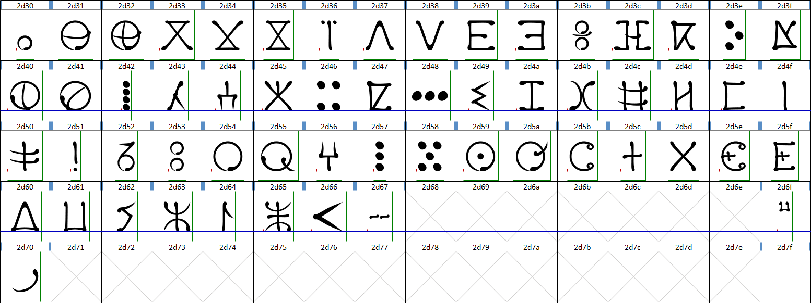

# OmniversifyFont 🖋️

### 💪🏻 ***THE Font For Every Moroccan*** 💪🏻

**OmniversifyFont** is a modern multilingual typeface designed to bridge cultures and scripts. It uniquely combines **Latin (English)**, **Arabic (Moroccan/Maghrebi script)**, and **Tamazight (Tifinagh script)** into a cohesive, high-performance font family.

Inspired by the rich architectural and calligraphic heritage of Morocco, OmniversifyFont brings a "Moroccan Luxury" aesthetic to digital typography, ensuring legibility and elegance across diverse linguistic landscapes.

---

## 🌍 Supported Scripts

OmniversifyFont is built on the philosophy of universal connectivity:

### 🇦🔤 Latin (English)

Modern, clean, and highly legible. Designed to complement the organic flow of Arabic and the geometric precision of Tifinagh.

### 🇲🇦 Arabic (Moroccan Maghrebi)

Dedicated to the traditional Moroccan Maghrebi script, characterized by its distinctive roundness and unique diacritic placements, optimized for modern digital displays without losing its calligraphic soul.

### ⵣ Tamazight (Tifinagh)

Honoring the ancestral script of North Africa. The Tifinagh characters are designed with a balance of geometric tradition and modern clarity, making it suitable for both headlines and body text.

---

## ✨ Key Features

- **Harmonious Multi-script Design**: Consistent weight and optical balance across all three scripts.
- **Moroccan Aesthetic**: Subtle nods to Moroccan artistry and geometry.
- **Modern Performance**: Optimized for web, mobile, and print applications.
- **OpenType Support**: Advanced features for ligature handling and script switching.

---

## 🛠 Project Structure (Planned)

```text
OmniversifyFont/
├── sources/               # Font source files (Glyphs, UFO, etc.)
├── exports/               # Generated OTF, TTF, WOFF2 files
├── documentation/         # Design docs and specimens
├── images/         # Design docs and specimens
└── README.md
```

### Supporting Tools

To assist with glyph manipulation and analysis, we use the [FontGlyphExtractor](https://github.com/phaylali/FontGlyphExtractor), a dedicated tool for high-precision SVG extraction.

---

## 🚀 Roadmap

### Phase 1: Foundation & Design (Current Phase)
- [x] **Basic Latin Character Set** (C0 Controls and Basic Latin)
- [x] **Tifinagh Character Set** (Tifinagh)
- [ ] **Arabic Character Set** (Arabic Supplement)

### Phase 2: Refinement & Production
- [ ] **Kerning and OpenType Feature Programming**
- [ ] **Multilingual Specimen Page**
- [ ] **Final Production Release**

---

## Progress (Added Unicodes)

### ASCII (C0 Controls and Basic Latin)


[ASCII+Latin Character Set](https://www.unicode.org/charts/PDF/U0000.pdf)

### Tifinagh



[Tifinagh Character Set](https://www.unicode.org/charts/PDF/U2D30.pdf)

### Arabic

N/A

[Arabic Character Set](https://www.unicode.org/charts/PDF/U0600.pdf)


This project is licensed under the [SIL Open Font License 1.1](http://scripts.sil.org/OFL).

---

_Part of the Omniversify Ecosystem — Connecting worlds through design._
