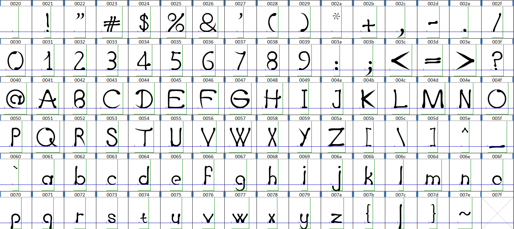
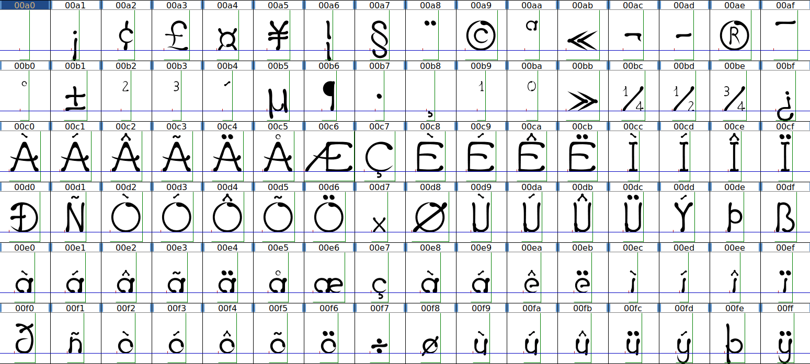
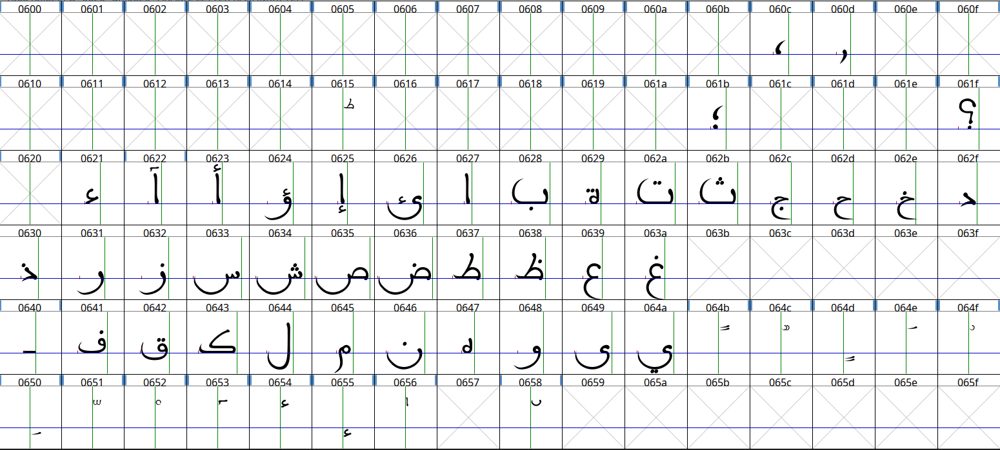
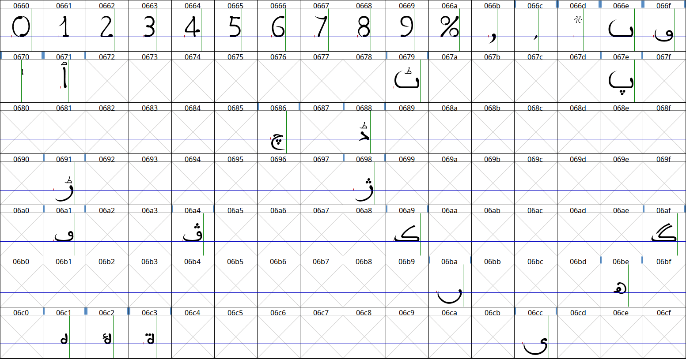
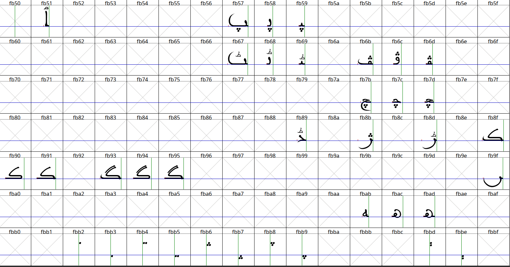
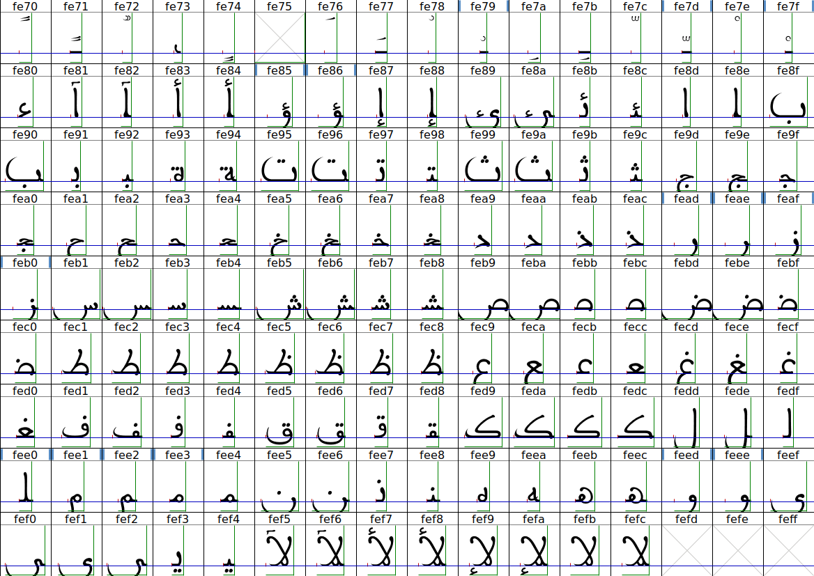
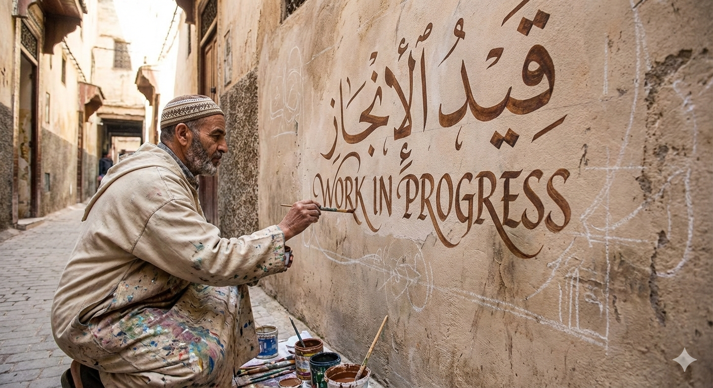
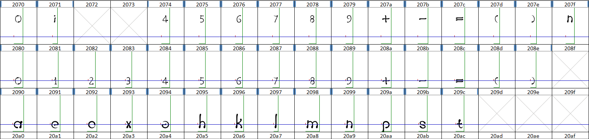

# OmniversifyFont 🖋️

### 💪🏻 **_THE Font For Every Moroccan_**

**OmniversifyFont** is a modern multilingual typeface designed to bridge cultures and scripts. It uniquely combines **Latin (English)**, **Arabic (Moroccan/Maghrebi script)**, and **Tamazight (Tifinagh script)** into a cohesive, high-performance font family.

Inspired by the rich architectural and calligraphic heritage of Morocco, OmniversifyFont brings a "Moroccan Luxury" aesthetic to digital typography, ensuring legibility and elegance across diverse linguistic landscapes.

---

## 🌍 Supported Scripts

OmniversifyFont is built on the philosophy of universal connectivity:

### 🇦🔤 Latin (English)

Modern, clean, and highly legible. Designed to complement the organic flow of Arabic and the geometric precision of Tifinagh.

### 🇲🇦 Arabic (Moroccan Maghrebi)

Dedicated to the traditional Moroccan Maghrebi script, characterized by its distinctive roundness and unique diacritic placements, optimized for modern digital displays without losing its calligraphic soul.

### ⵣ Tamazight (Tifinagh)

Honoring the ancestral script of North Africa. The Tifinagh characters are designed with a balance of geometric tradition and modern clarity, making it suitable for both headlines and body text.

---

## ✨ Key Features

- **Harmonious Multi-script Design**: Consistent weight and optical balance across all three scripts.
- **Moroccan Aesthetic**: Subtle nods to Moroccan artistry and geometry.
- **Modern Performance**: Optimized for web, mobile, and print applications.
- **OpenType Support**: Advanced features for ligature handling and script switching.

---

## 🛠 Project Structure (Planned)

```text
OmniversifyFont/
├── sources/               # Font source files (Glyphs, UFO, etc.)
├── exports/               # Generated OTF, TTF, WOFF2 files
├── documentation/         # Design docs and specimens
├── images/         # Design docs and specimens
└── README.md
```

### Supporting Tools

To assist with glyph manipulation and analysis, we use the [FontGlyphExtractor](https://github.com/phaylali/FontGlyphExtractor), a dedicated tool for high-precision SVG extraction.

---

## 🚀 Roadmap

### Phase 1: Foundation & Design (Current Phase)

- [x] **ASCII Character Set** (C0 Controls and Basic Latin)
- [x] **Latin-1 Character Set** (Latin-1 Supplement)
- [x] **Tifinagh Character Set** (Tifinagh)
- [x] **Arabic Character Set** (Arabic)
- [ ] **Arabic Character Set Forms-A** (Arabic Presentation Forms-A)
- [x] **Arabic Character Set Forms-B** (Arabic Presentation Forms-B)
- [ ] **Currency Character Set** (Currency Symbols)

### Phase 2: Refinement & Production

- [ ] **Kerning and OpenType Feature Programming**
- [ ] **Multilingual Specimen Page**
- [ ] **Final Production Release**

---

## Work In Progress (Added Unicodes)

### ASCII (C0 Controls and Basic Latin)



[ASCII+Latin Character Set](https://www.unicode.org/charts/PDF/U0000.pdf)

### Latin-1 Supplement



[Latin-1 Supplement Character Set](https://www.unicode.org/charts/PDF/U0080.pdf)

### Tifinagh


[Tifinagh Character Set](https://www.unicode.org/charts/PDF/U2D30.pdf)

### Arabic




[Arabic Character Set](https://www.unicode.org/charts/PDF/U0600.pdf)

### Arabic Presentation Forms-A



[Arabic Presentation Forms-A Character Set](https://www.unicode.org/charts/PDF/UFB50.pdf)

### Arabic Presentation Forms-B



[Arabic Presentation Forms-B Character Set](https://www.unicode.org/charts/PDF/UFB00.pdf)

### Currency Symbols



[Currency Symbols Character Set](https://www.unicode.org/charts/PDF/U20A0.pdf)

### Superscripts and Subscripts



[Superscripts and Subscripts Character Set](https://www.unicode.org/charts/PDF/U2070.pdf)

---

This project is licensed under the [SIL Open Font License 1.1](http://scripts.sil.org/OFL).

---

## Support Us

<p align="center">
  <a href="https://ko-fi.com/omniversify">
    
  </a>
</p>

<p align="center">
  <strong>Keep us going</strong>
</p>

---

&copy; 2026 [Omniversify](https://omniversify.com). All rights reserved.

_Made by Moroccans, for the Omniverse_

[](https://donate.unrwa.org/-landing-page/en_EN)
